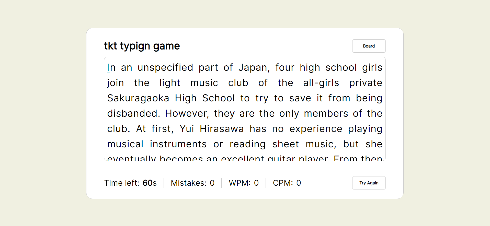
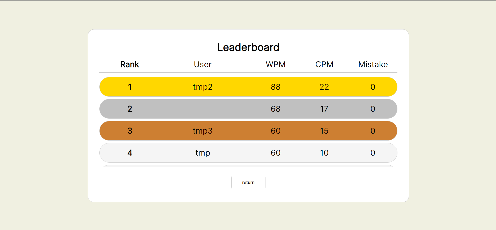
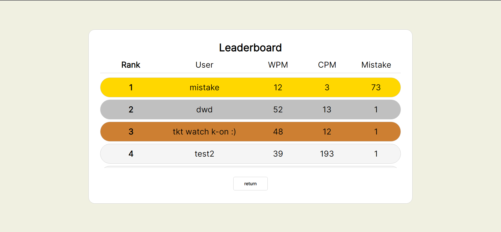
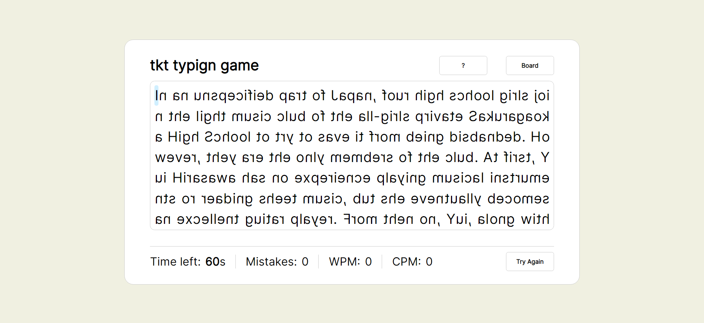

# Boring project - Typing game in website # 

## Typing test ##


## With leaderboard ##


## You can sort by mistakes ??? ## 



## Modes Introduction ##
### Rotate mode ###



## Updates, which are typically not performed :) ##
1. Daily/weekly board
2. 1v1 function (who wants to play 1v1 in a typing game lol)
3. mods in game (DT/HD/HR) - yea osu

## What is firebase-config.js ##
- confidential
```
const firebaseConfig = {
    apiKey: {apiKey},
    authDomain: {authDomain},
    projectId: {ProjectId},
    storageBucket: {storageBucket},
    messagingSenderId: {messagingSenderId},
    appId: {appId}
};
``` 

## Credit ##
- HKOI 2023 mini comp2 (which push me back to write website xd)
- firestore
- [CSS basically follow this video to do lol](https://www.youtube.com/watch?v=Hg80AjDNnJk)